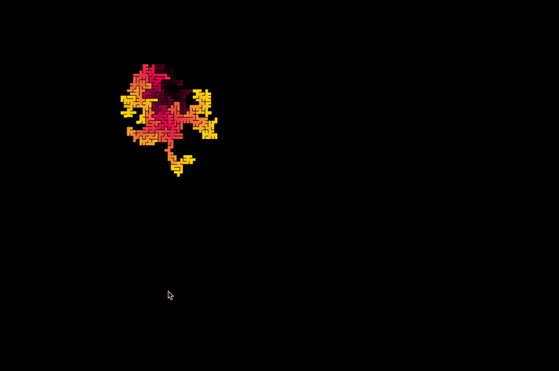
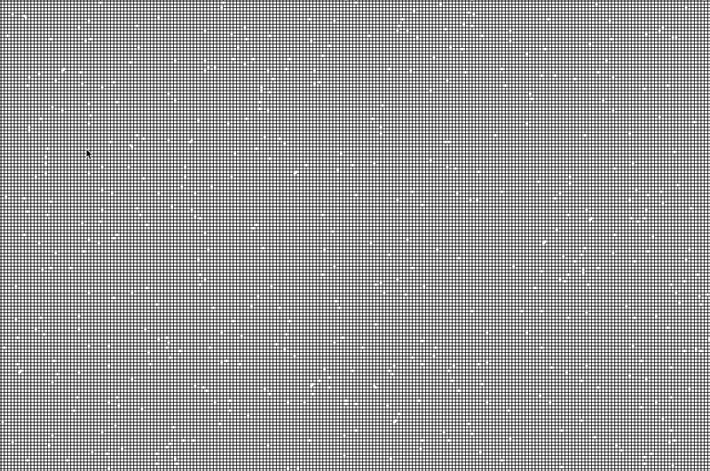

# Maze Animation

This project, written in **C++** using **SFML 3.0.0.1**, generates a maze and then animates it. The maze generation is relatively fast, typically taking between 0 and 20 seconds (usually around 3 seconds on my machine).

This project is heavily inspired by the YouTube video *"I coded one project EVERY WEEK for a YEAR"* by **@CarterSemrad**.

### Customizable Options (in `const.h`)
- Wall thickness (must be **less than to** the `case size`)
- Case size (recommended between **4 and 20**)
- Start and end colors (in RGB format)
- Visibility of the maze creation process
- Speed of the color gradient




## Installation

1. Clone the repository:
```bash
git clone git@github.com:JulesGrelier/Maze-animation.git
```

2. Open the `makefile` and set the correct `SFML_PATH` for your system.

Go to makefile and replace `SFML_PATH` and run :

```bash
cd Maze-animation
make
